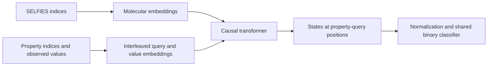

# Model architecture

## Input and output

The `MultitaskEncoder` class implements a causal transformer over a molecular token sequence followed by interleaved property queries and observed values. Its name is inherited from upstream; the attention computation is causal.

Inputs are four tensors:

| Tensor | Shape | Meaning |
| --- | --- | --- |
| `selfies` | `[batch, molecule_length]` | SELFIES vocabulary indices, including start/end and padding tokens |
| `properties` | `[batch, property_count]` | Zero-based property indices in `[0, num_assays)` |
| `values` | `[batch, property_count]` | Binary class indices, `0` or `1` |
| `mask` | `[batch, property_count]` | True for observed property/value pairs; false for padding |

The output has shape `[batch, property_count, 2]`. A softmax over the final axis gives probabilities of the two classes. Property indices are checkpoint-specific. A published property mapping is necessary to associate an index with an assay or endpoint.

## Causal sequence and teacher forcing

The transformer sees the following sequence of embeddings:

```text
SELFIES tokens ... | property_1 | value_1 | property_2 | value_2 | ...
```

Each value embedding is added to the embedding of its corresponding property. All input embeddings are multiplied by the square root of the hidden dimension.

The classifier reads the hidden state at each **property-query position**, immediately before the corresponding value token. A query can attend to molecular tokens and earlier observed property/value pairs. It cannot attend to its own value or later values. The tests change target and future labels and verify that the corresponding predictions remain unchanged.



For structure-only evaluation, the workflow predicts each property in a separate sequence with no observed property context. For contextual evaluation, the target query follows the explicitly selected context pairs. These evaluation settings answer different scientific questions and are reported separately.

## Transformer blocks

Each block applies pre-normalization, multi-head self-attention, a residual connection, another normalization, and a feed-forward network with a second residual connection. The inspected checkpoint uses RMSNorm and a SwiGLU feed-forward network. Rotary position embeddings encode positions. Attention uses PyTorch scaled-dot-product attention when enabled, with a manual implementation available for comparison.

The model combines the causal mask with a key-padding mask. During training, optional SELFIES span masking zeros selected molecular embeddings and removes those positions from attention. Span lengths are sampled approximately geometrically and capped at ten tokens in the upstream implementation. The configured masking rate is a sampling target, not a guarantee of the exact fraction masked in each sequence.

## Inspected checkpoint

| Field | Value |
| --- | --- |
| Hidden dimension | 512 |
| Attention heads | 8 |
| Layers | 16 |
| Feed-forward multiplier | 3 |
| Maximum combined sequence length | 4,096 |
| SELFIES embedding vocabulary | 2,481 |
| Property embedding vocabulary | 6,647 |
| Value classes | 2 |
| Parameters | 59,218,946 |

The exact configuration is in `configs/upstream-architecture.json`. `configs/research.json` uses the same principal dimensions but enables gradient checkpointing and supplies a new reference optimization schedule. Changing the vocabulary changes the embedding parameter counts.

Several inherited configuration fields are not active switches in the current forward path. `intermediate_dim` is unused; feed-forward width is `hdim * ff_mult`. With SwiGLU selected, `dropout_rate` does not add feed-forward dropout; attention and residual dropout use `attention_dropout` and `layer_dropout`. `PropertyFiLMHead` is defined upstream but the inspected model uses the shared classifier instead. Documenting these distinctions is necessary to interpret a configuration accurately.

## Checkpoint format

A checkpoint directory contains `multitask_encoder.pt` and two JSON tokenizer files under `spvt_tokenizer/`. The released inference bundle also includes `properties.json`, which maps model indices to source property identifiers and available titles. The tensor file stores the state dictionary, architecture configuration, model version, parameter counts, and metadata. The research loader uses `weights_only=True` and strict state-dictionary matching. Missing or unexpected parameters produce an error instead of silently leaving parts of the model uninitialized.
